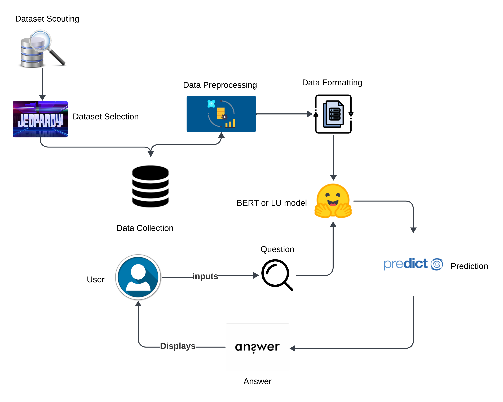
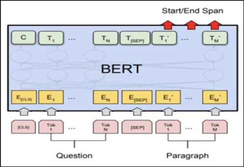
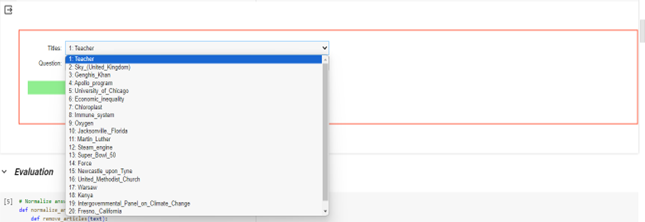

# Building a Language Understanding and Question-Answering System with BERT

This project leverages BERT for creating a robust question-answering system fine-tuned on the SQuAD dataset. The system aims to improve accuracy and efficiency in understanding and responding to queries.

## Table of Contents

- [Introduction](#introduction)
- [Problem Statement](#problem-statement)
- [Methodology](#methodology)
  - [Workflow Diagram](#workflow-diagram)
  - [Architecture](#architecture)
- [Dataset](#dataset)
  - [Data Preparation](#data-preparation)
- [Implementation](#implementation)
  - [Algorithm/Pseudocode](#algorithmpseudocode)
  - [Libraries Used](#libraries-used)
  - [Integration of NLP Techniques](#integration-of-nlp-techniques)
- [Results](#results)
  - [Performance](#performance)
  - [Interesting Results](#interesting-results)
- [Project Management](#project-management)
  - [Completed Work](#completed-work)
  - [Issues Faced](#issues-faced)
- [References](#references)

## Introduction

Natural Language Processing (NLP) is ever-evolving, with question-answering (QA) systems being a crucial part of various services. This project focuses on enhancing QA systems using transformer-based models like BERT, fine-tuned with the SQuAD dataset.

## Problem Statement

Despite advancements in NLP, current QA systems face challenges in contextual understanding, handling ambiguous queries, and domain adaptability. This project aims to address these issues using BERT.

## Methodology

### Workflow Diagram

### Architecture

## Dataset

The dataset used is the Stanford Question Answering Dataset (SQuAD), containing over 100,000 question-answer pairs derived from more than 500 Wikipedia articles.

### Data Preparation

- Tokenization
- Cleaning
- Normalization
- Answer Mapping
- Truncation & Padding
- Attention Masking

## Implementation

### Algorithm/Pseudocode

Detailed pseudocode for loading the model, preprocessing data, fine-tuning, and inference.

### Libraries Used

- **Preprocessing:** `string`, `re`, `defaultdict`, `collections`
- **Visualizations:** `Seaborn`, `Matplotlib`, `WordCloud`, `IPython.display`
- **Model and Evaluation:** `Transformers`, `Torch`, `BertTokenizer`, `BertForQuestionAnswering`

### Integration of NLP Techniques

Combining BERT's tokenization, attention mechanisms, and transfer learning to improve QA performance.

### Steps to use

1. Select a topic you need information about:
   

2. Input a question can be in any human written form with typos too:
   

3. Finally, retrieves the Answer and Context along with it:

## Results

### Performance

- Exact Match (EM): 23.1%
- F1 Score: 34.07%

### Interesting Results

Examples of the model's ability to handle rephrased questions effectively.

## Project Management

### Completed Work

- BERT Model Integration
- Data Pre-processing Pipeline
- Model Training and Evaluation
- User Interface Development

### Issues Faced

- Data Quality
- Model Overfitting
- Computational Resources
- User Experience

## References

1. [Adversarial QA](https://adversarialqa.github.io/)
2. [Large QA Datasets](https://github.com/ad-freiburg/large-qa-datasets)
3. [Devlin, J., Chang, M., Lee, K., & Toutanova, K. (2019). BERT: Pre-training of Deep Bidirectional Transformers for Language Understanding. North American Chapter of the Association for Computational Linguistics.](https://arxiv.org/abs/1810.04805)
4. [Radford, A., & Narasimhan, K. (2018). Improving Language Understanding by Generative Pre-Training.](https://openai.com/research/language-understanding-with-gpt)
5. [Peters, M.E., Ruder, S., & Smith, N.A. (2019). To Tune or Not to Tune? Adapting Pretrained Representations to Diverse Tasks. ArXiv, abs/1903.05987.](https://arxiv.org/abs/1903.05987)
6. [Wynter, A.D., & Perry, D.J. (2020). Optimal Subarchitecture Extraction For BERT. ArXiv, abs/2010.10499.](https://arxiv.org/abs/2010.10499)
7. [Wang, W., Bi, B., Yan, M., Wu, C., Bao, Z., Peng, L., & Si, L. (2019). StructBERT: Incorporating Language Structures into Pre-training for Deep Language Understanding. ArXiv, abs/1908.04577.](https://arxiv.org/abs/1908.04577)
8. [Rajpurkar, P., Zhang, J., Lopyrev, K., & Liang, P. (2016). SQuAD: 100,000+ Questions for Machine Comprehension of Text. Conference on Empirical Methods in Natural Language Processing.](https://arxiv.org/abs/1606.05250)
9. [Liu, X., Cheng, H., He, P., Chen, W., Wang, Y., Poon, H., & Gao, J. (2020). Adversarial Training for Large Neural Language Models. ArXiv, abs/2004.08994.](https://arxiv.org/abs/2004.08994)

